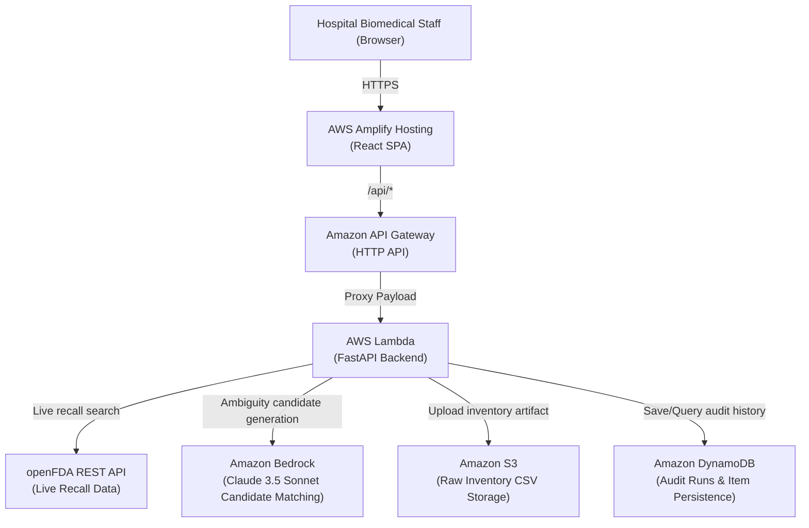

# Reclaro

> Evidence-backed medical recall matching for messy hospital inventory data.

Hospitals receive medical-device recall notices, but their inventory systems often contain inconsistent manufacturer names, product descriptions, model values, catalog numbers, and identifiers. Reclaro connects live openFDA recall data with hospital inventory CSVs and determines which inventory records have sufficient evidence to fall within the recall scope.

Reclaro is an engineering prototype. openFDA data should not be treated as a substitute for official manufacturer recall notices or clinical and regulatory decision-making.

---

## Core Idea

The core technical principle of Reclaro is:

> **"Bedrock proposes candidates; deterministic verification establishes confirmation."**

While generative AI is effective at handling messy terminology, acronyms, and ambiguous trade names, clinical inventory decisions demand verifiable proof. In Reclaro:

1. **Live Recall Ingestion:** Queries the public openFDA Device Recall API to retrieve active Class I and II medical device recall notices.
2. **Recall Scope Normalization:** Parses models, catalog/REF numbers, GTIN/UDI-DI codes, lot/serial scopes, and conditional distribution dates from unstructured recall text.
3. **Inventory Normalization:** Strips corporate suffixes (Inc, LLC, Corp), normalizes punctuation and alphanumeric formatting, and tokenizes descriptions.
4. **Bedrock-Assisted Candidate Generation:** Uses Amazon Bedrock (Claude 3.5 Sonnet) to generate candidate signals for ambiguous inventory records that resist exact string matching.
5. **Deterministic Evidence Verification:** Evaluates records against deterministic rules. An exact manufacturer match combined with verified identifiers (UDI-DI, catalog number, model) and scope bounds (lot, serial, distribution date) is required for confirmation.
6. **Three Evidence-Backed Outcomes:**
   - **CONFIRMED:** Exact deterministic evidence supports inclusion in the recall scope.
   - **NEEDS_REVIEW:** Evidence suggests a possible match, but deterministic proof is incomplete or unverified.
   - **NOT_AFFECTED:** Available evidence does not support inclusion.
7. **Evidence & Audit Persistence:** Every audit run is saved with its raw inventory artifact stored in Amazon S3 and structured run metadata and item records persisted in Amazon DynamoDB.

**AI boundary:** Bedrock proposes candidates; deterministic verification establishes confirmation. AI candidate evidence can help surface uncertain records into `NEEDS_REVIEW` so they are not silently missed, but AI candidate evidence alone can **never** produce a `CONFIRMED` status.

---

## Architecture

### System Architecture & Request Path



### Logical Matching Pipeline

```
FDA Recall Notice (openFDA)      Hospital Inventory CSV
             │                              │
             ▼                              ▼
     Recall Normalization          Inventory Normalization
             │                              │
             └──────────────┬───────────────┘
                            ▼
                     Amazon Bedrock
            (AI candidate generation / ambiguity)
                            │
                            ▼
              Deterministic Verification Engine
                  (Exact identifier rules)
                            │
              ┌─────────────┼─────────────┐
              ▼             ▼             ▼
          CONFIRMED    NEEDS_REVIEW   NOT_AFFECTED
              │             │             │
              └─────────────┼─────────────┘
                            ▼
                 Evidence & Audit Persistence
                   (Amazon S3 + DynamoDB)
                            │
                            ▼
                 Dashboard & Audit History
```

---

## Hospital Inventory CSV Format

Reclaro accepts standard hospital inventory CSV files. The parsing engine maps the following columns:

| Column | Required | Description |
|---|---|---|
| `inventory_id` | **Yes** | Unique hospital asset or inventory tracking tag (e.g. `INV-2024-001`) |
| `manufacturer` | **Yes** | Device manufacturer name (e.g. `Smith & Nephew`, `Baxter Healthcare`) |
| `product_name` | **Yes** | Commercial or trade name of the medical device |
| `model` | No | Specific model designation or name |
| `catalog_number` | No | Manufacturer catalog or reference number (`REF`) |
| `udi_di` | No | GS1 GTIN or FDA Unique Device Identifier — Device Identifier |
| `lot_number` | No | Manufacturing lot or batch identifier |
| `serial_number` | No | Individual device serial number |
| `distribution_date` | No | Supply or distribution date (`YYYY-MM-DD`) |
| `quantity` | No | Quantity in stock at the facility |
| `location` | No | Hospital department, room, or shelf location |

Synthetic demonstration datasets are provided in [`data/synthetic_inventory/`](data/synthetic_inventory/) and packaged in the frontend under [`frontend/public/demo/`](frontend/public/demo/).

---

## AWS Services Actually Used

| AWS Service | Actual role in Reclaro |
|---|---|
| **AWS Amplify Hosting** | Hosts the React Single Page Application and manages routing and rewrite rules to API Gateway |
| **Amazon API Gateway** | Exposes the HTTP API (`/api/recalls`, `/api/match`, `/api/audits`, `/api/audits/{run_id}`) |
| **AWS Lambda** | Runs the serverless FastAPI backend, normalization engine, candidate generator, and verification rules |
| **Amazon Bedrock** | Invokes Claude 3.5 Sonnet to propose candidates for ambiguous records that resist exact string matching |
| **Amazon S3** | Stores uploaded hospital inventory CSV files as immutable audit artifacts (`s3_storage.py`) |
| **Amazon DynamoDB** | Persists audit run metadata, per-item diagnostic records, and indexes run history via `AuditRunIndex` GSI (`dynamodb_storage.py`) |

---

## Matching Logic & Authoritative Rules

Reclaro enforces strict hierarchical verification rules:

* **CONFIRMED:** Requires deterministic manufacturer match **AND** an exact identifier match (`EXACT_UDI_MATCH`, `EXACT_CATALOG_MATCH`, or `EXACT_MODEL_MATCH`) **AND** verified scope bounds:
  - If the recall restricts lots, the lot number must match or the recall must apply to all lots (`ALL_LOTS`).
  - If the recall restricts serials, the serial number must match or the recall must apply to all serials (`ALL_SERIALS`).
  - If the recall specifies a distribution cutoff date (e.g., distributed prior to a date), the inventory item must possess a verified distribution date before that cutoff.
* **NEEDS_REVIEW:** Triggered when meaningful candidate evidence exists (e.g., manufacturer matches and model resembles recall, product family token overlap, or Bedrock proposed candidate signals), but deterministic identifier or scope proof is incomplete (such as a missing lot number or missing distribution date).
* **NOT_AFFECTED:** Assigned when available inventory fields do not match the recall specifications. This represents a screening outcome based on provided data, not a clinical guarantee that the device is free from defect or excluded from other recalls.

---

## Evidence & Audit History

Every audit execution generates a traceable, immutable audit record:
- **Raw Artifact:** The original uploaded CSV is written to Amazon S3 with SHA-256 hash tracking.
- **Run Metadata:** Total items audited, counts of `CONFIRMED`, `NEEDS_REVIEW`, and `NOT_AFFECTED` stored in DynamoDB under `RUN#<run_id>`.
- **Item Diagnostics:** Each inventory record's matched signals, extracted recall scope, matched rule, and recommended biomedical engineering action are persisted under `ITEM#<run_id>#<inventory_id>`.
- **Queryable History:** The DynamoDB Global Secondary Index `AuditRunIndex` enables immediate querying of all past audit runs for compliance review without re-executing matching.

---

## Engineering Benchmark

Reclaro includes an automated engineering benchmark (`benchmarks/reclaro_benchmark.py`) evaluated against a controlled 30-case dataset (`benchmarks/ground_truth.csv`):

* **Total cases:** 30
* **Ground Truth AFFECTED:** 23
* **Ground Truth NOT_AFFECTED:** 7

### Comparative Results

| Metric | Naive Exact-String Baseline | Reclaro |
|---|---|---|
| **True Positives (TP, strict confirmed)** | 18 | 21 |
| **False Positives (FP)** | 1 | 1 *(B15 catalog collision limitation)* |
| **False Negatives (FN, strict)** | 5 *(all silent NOT_AFFECTED)* | 2 *(both escalated to NEEDS_REVIEW)* |
| **True Negatives (TN)** | 6 | 6 |
| **Strict Precision** | 0.947 (18 / 19) | 0.955 (21 / 22) |
| **Strict Recall** | 0.783 (18 / 23) | 0.913 (21 / 23) |
| **False Positive Rate (FPR)** | 0.143 (1 / 7) | 0.143 (1 / 7) |
| **Review Rate** | 0.000 | 0.067 (2 / 30 cases) |
| **Screened Detection Coverage** | 0.783 (18 / 23) | 1.000 (23 / 23) |

*Metric Notes:*
- **Strict Recall** measures deterministically confirmed matches against ground-truth affected items `TP / (TP + FN)`. It is strictly distinct from overall accuracy.
- **Screened Detection Coverage** measures the proportion of ground-truth affected items surfaced by either confirmed match or review escalation: `(TP + NEEDS_REVIEW) / Total AFFECTED`. Under Reclaro, 100% (23/23) of affected items were surfaced rather than silently dropped.
- **B15 Catalog Collision:** Case B15 represents an item from the same manufacturer where catalog numbers collide across distinct product families. Because Reclaro enforces identifier matching without a separate heuristic product-family exclusion gate, B15 triggers CONFIRMED and is correctly counted as a False Positive (FPR = 0.143).
- **Engineering benchmark notice:** This benchmark evaluates string-matching and rule-verification mechanics on synthetic test data. It does NOT constitute clinical evidence or safety validation.

---

## Demonstration Workflow

Reclaro supports an end-to-end audit demonstration:

1. **Select a Recall:** Search live recalls from openFDA or select the guided demonstration case (Smith & Nephew Recall 80313).
2. **Load Inventory:** Click **Try Demo Case** to automatically load a synthetic hospital inventory sample, or upload a custom CSV.
3. **Run Audit:** Trigger `/api/match` to upload the CSV to S3, run Bedrock candidate evaluation, and apply deterministic verification rules.
4. **Inspect Metrics:** Review summary statistics showing total audited, confirmed matches, review escalations, and non-affected counts.
5. **Inspect Evidence:** Open the **Evidence Drawer** on any inventory item to view exact matched signals, raw recall scope, and recommended biomedical engineering actions.
6. **Persistence:** Audit metadata and item records are stored in DynamoDB; the original inventory CSV is saved in S3.
7. **Audit History:** Navigate to **Audit History** to view previous runs queried through the DynamoDB GSI.
8. **Audit Detail:** Drill down into any historical run to inspect per-item evidence without re-running the match.

---

## Repository Structure

```
reclaro/
├── backend/
│   ├── api/
│   │   └── main.py                     # FastAPI application endpoints
│   ├── models/
│   │   └── schemas.py                  # Pydantic schemas (Recall, NormalizedRecall, InventoryItem, MatchResult)
│   ├── services/
│   │   ├── bedrock/
│   │   │   └── candidate_service.py    # Amazon Bedrock Claude candidate generation
│   │   ├── evidence/
│   │   │   └── evidence_builder.py     # Diagnostic evidence explanation builder
│   │   ├── fda/
│   │   │   └── fda_client.py           # openFDA REST API client
│   │   ├── matching/
│   │   │   └── candidate_generator.py  # Deterministic & candidate signal generation
│   │   ├── normalization/
│   │   │   └── normalizer.py           # Entity suffix, punctuation & token normalizers
│   │   ├── recall_parser/
│   │   │   └── parser.py               # Scope parser (UDI, catalog, model, lot/serial, dates)
│   │   ├── storage/
│   │   │   ├── s3_storage.py           # S3 inventory CSV upload service
│   │   │   └── dynamodb_storage.py     # DynamoDB audit persistence & GSI query service
│   │   └── verification/
│   │       └── verifier.py             # Authoritative deterministic verification engine
│   ├── aws_handler.py                  # Mangum handler for AWS Lambda
│   └── tests/                          # Pytest test suite (46 unit & adversarial tests)
├── benchmarks/
│   ├── ground_truth.csv                # 30 controlled evaluation test cases
│   ├── reclaro_benchmark.py            # Local engineering benchmark script
│   └── README.md                       # Benchmark methodology documentation
├── data/
│   └── synthetic_inventory/
│       ├── hospital_inventory_sample.csv
│       └── hospital_inventory_sample_recall_80313.csv
├── frontend/
│   ├── public/
│   │   └── demo/
│   │       └── hospital_inventory_sample_recall_80313.csv
│   ├── src/
│   │   ├── components/                 # UI components (Header, ArchitectureOverlay, EvidenceDrawer, etc.)
│   │   ├── pages/                      # Dashboard, AuditHistoryPage, AuditDetailPage
│   │   ├── services/                   # Frontend API integration
│   │   └── types/                      # TypeScript definitions
│   ├── package.json
│   └── vite.config.ts
├── template.yaml                       # AWS SAM infrastructure template
├── samconfig.toml                      # SAM deployment configuration
├── requirements.txt                    # Python backend dependencies
└── README.md                           # Project documentation
```

---

## Local Development

### 1. Backend Setup

Prerequisites: Python 3.10+ (tested on Python 3.14).

```bash
# Install dependencies
pip install -r requirements.txt

# Run FastAPI backend locally
uvicorn backend.api.main:app --reload --port 8000
```

Interactive API documentation will be available at `http://127.0.0.1:8000/docs`.

### 2. Frontend Setup

Prerequisites: Node.js 18+.

```bash
cd frontend

# Install dependencies
npm install

# Start development server
npm run dev
```

The frontend will run at `http://localhost:5173`.

### 3. Running Tests & Validation

```bash
# Run backend pytest suite (46 tests)
py -3.14 -m pytest backend/tests -v

# Run benchmark script
py -3.14 benchmarks/reclaro_benchmark.py

# Validate SAM template
sam validate

# Build frontend bundle
cd frontend
npm run build
```

---

## Deployment & Demo Information

- **Backend:** Configured as a serverless application via AWS SAM ([`template.yaml`](template.yaml)):
  - **Amazon API Gateway:** HTTP API with proxy routing to Lambda.
  - **AWS Lambda:** Python 3.14 runtime running FastAPI via Mangum.
  - **Amazon S3:** Encrypted bucket with public access blocked (`ReclaroInventoryBucket`).
  - **Amazon DynamoDB:** Pay-per-request table with Point-in-Time Recovery and GSI (`ReclaroAuditTable`, `AuditRunIndex`).
- **Frontend:** Hosted on AWS Amplify Hosting with rewrite rules forwarding `/api/*` requests to the API Gateway endpoint.
- **Live Demo Flow:** Biomedical engineers can use the web interface to select active recalls from openFDA, load synthetic hospital inventory data, execute matching audits, and inspect historical audit records stored in DynamoDB.

---

## Limitations & Disclaimers

* **Engineering Prototype:** Reclaro is an engineering prototype developed for demonstration purposes. It is not FDA-cleared, CE-marked, or clinically validated.
* **openFDA API Disclaimer:** openFDA recall records are public notification summaries. They may contain omissions, typographical variations, or unstructured free-form text. openFDA data should never replace direct manufacturer notifications, Urgent Medical Device Correction letters, or official regulatory communications.
* **Catalog Collisions Across Families (B15 Limitation):** When manufacturers use overlapping or range-based catalog numbering across different product families without unique model/UDI distinction, catalog-based matching can produce a false positive. Reclaro prioritizes deterministic identifier matching, highlighting the necessity of biomedical engineering verification.
* **Screening vs. Clinical Decision:** A `CONFIRMED` status indicates deterministic alignment between inventory attributes and parsed recall scope parameters. It does not replace physical biomedical device quarantine. A `NOT_AFFECTED` status indicates lack of evidence in the provided fields, not a certification of device safety.
* **Human-in-the-Loop:** All items marked `NEEDS_REVIEW` are surfaced specifically for manual physical inspection by hospital clinical engineering staff.
